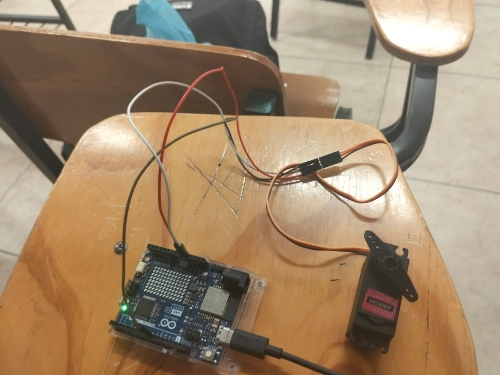
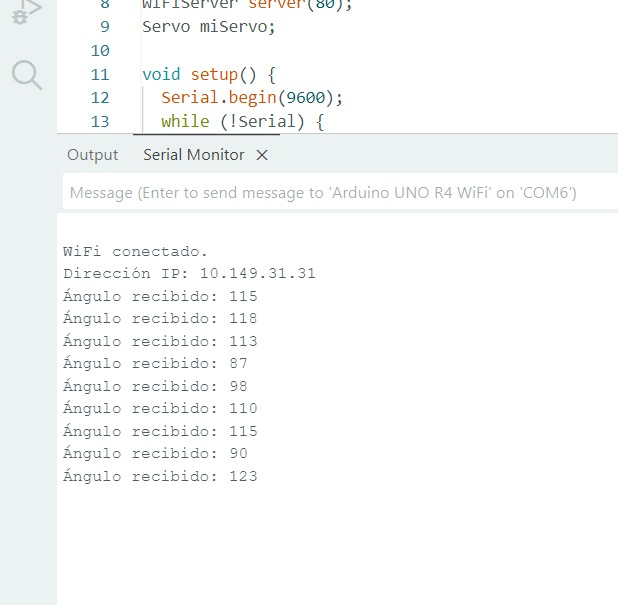

# Control de servomotor por interfaz web

Sistema de control de un servomotor mediante una interfaz web alojada en Arduino UNO R4 WiFi.

## Descripción

Este proyecto permite controlar el ángulo de un servomotor en tiempo real desde una página web generada por el propio Arduino. El usuario mueve un control deslizante (slider) desde su navegador, y el Arduino recibe el valor mediante una petición HTTP y mueve el servomotor a la posición indicada.

## Objetivos de aprendizaje

Implementar un servidor web embebido en el Arduino UNO R4 WiFi capaz de recibir peticiones HTTP y controlar un servomotor mediante la librería Servo.h, interpretando parámetros enviados desde una interfaz web sencilla con HTML y JavaScript.

## Material utilizado

* Arduino UNO R4 WiFi
* Servomotor TowerPro MG996R
* Cables Dupont
* Cable USB para alimentación y programación
* Red WiFi local

## Diagrama del circuito

## Código

[Motor.ino](codigo/Motor.ino)

## Video del funcionamiento

[Ver video en YouTube](https://www.youtube.com/shorts/q48nZOm9120)

## Evidencias de armado

## Terminal

## Reporte

Incluye: [Reporte.pdf](Reporte/Reporte.pdf)

* Descripción del proyecto y objetivos
* Explicación del código y su funcionamiento
* Diagrama de conexión y montaje físico

## Conclusiones

Esta práctica permitió comprender cómo un microcontrolador con capacidad WiFi puede actuar simultáneamente como servidor web y como controlador de un actuador físico, reforzando el manejo de peticiones HTTP y el control de servomotores mediante parámetros recibidos desde una interfaz web en tiempo real.

## Resultados

Incluye: [Resultado.pdf](Resultado/Resultado.pdf)

* Tabla de pruebas por ángulo enviado
* Evidencia del Monitor Serial
* Observaciones generales del funcionamiento
