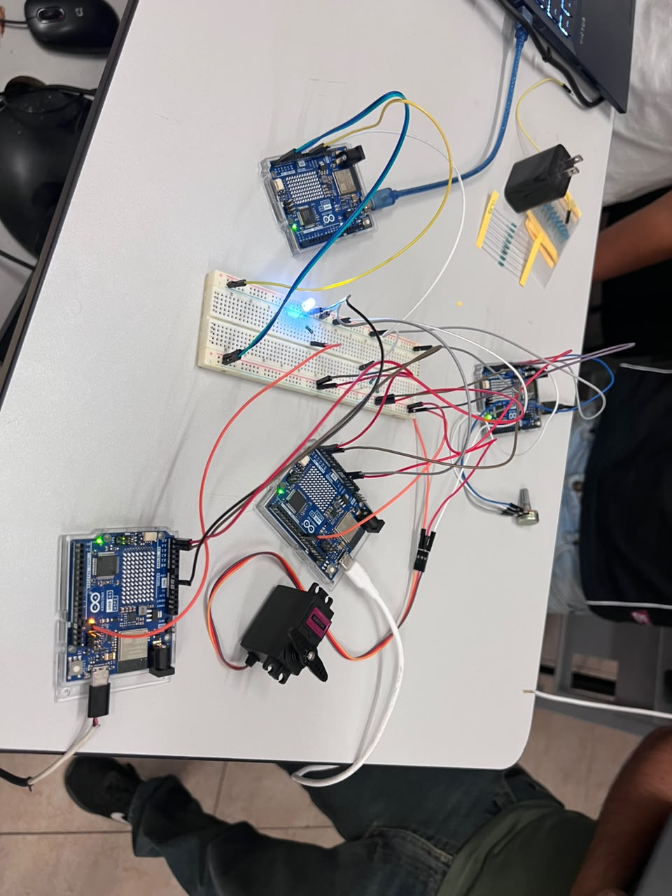

# Comunicación I2C entre 4 Arduinos

Sistema de comunicación mediante el bus I2C entre un Arduino maestro y tres Arduinos esclavos. Los dispositivos comparten las líneas SDA y SCL y utilizan direcciones diferentes (0x08, 0x09 y 0x0A). El sistema fue simulado en Tinkercad y posteriormente armado de forma física.

## Descripción

El Arduino maestro coordina la comunicación con tres esclavos: uno controla un LED, otro un servomotor y otro lee un potenciómetro. Cada 500 ms, el maestro solicita el valor del potenciómetro, lo convierte en un ángulo de 0° a 180° y lo envía al servo.

Además, desde el Monitor serie se puede enviar 1 o 0 para encender o apagar el LED. El maestro también informa el estado de la comunicación y detecta cuando algún esclavo no responde.

## Objetivos de aprendizaje

Comprender el funcionamiento del bus I2C mediante la comunicación entre un maestro y varios esclavos, utilizando direcciones diferentes para identificar cada dispositivo. También se practica el envío y recepción de datos mediante la librería `Wire` y la detección de errores con `endTransmission()` y `requestFrom()`.

Además, se utiliza `millis()` en lugar de `delay()` para evitar bloquear el programa durante la comunicación.

## Herramientas y material utilizado

* 4 Arduino Uno R4 WiFi
* 1 protoboard (Breadboard Small)
* 1 LED
* 1 resistencia de 470 Ω (LED) y 2 resistencias de 4.7 kΩ (pull-up en SDA y SCL)
* 1 micro servomotor
* 1 potenciómetro
* Cables de conexión
* Librerías Wire y Servo, y Monitor serie del Arduino IDE

## Diagrama del circuito

## Montaje físico

## Código

* [Maestro.ino](<Codigo/Maestro.ino>)
* [Esclavo1(LED).ino](<Codigo/Esclavo1Led.ino>)
* [Esclavo2(servo).ino](<Codigo/Esclavo2Servo.ino>)
* [Esclavo3(potenciómetro).ino](<Codigo/Esclavo3Potonciometro.ino>)

## Reporte

* [Reporte.pdf](<Reporte/Reporte.pdf>)

## Resultados

Durante las pruebas, los tres esclavos respondieron correctamente a sus respectivas direcciones. El LED respondió a los valores 1 y 0 enviados desde el Monitor serie, el servomotor siguió los cambios del potenciómetro y el maestro detectó cuando algún esclavo dejó de responder.

El uso de `millis()` permitió realizar estas tareas sin bloquear la ejecución del programa.

## Video del funcionamiento

* [Ver video en YouTube](https://youtu.be/xtoZlY5BY0I)

## Conclusiones

El protocolo I2C permite comunicar varios dispositivos utilizando las líneas SDA y SCL, además de una tierra común. Cada esclavo debe tener una dirección única para evitar conflictos durante la comunicación.

El maestro controla cuándo enviar o solicitar información, mientras que los esclavos responden cuando son llamados. La comprobación de `endTransmission()` permite detectar errores de comunicación, como un NACK, y el uso de `millis()` evita que el programa se bloquee mientras realiza otras tareas.
